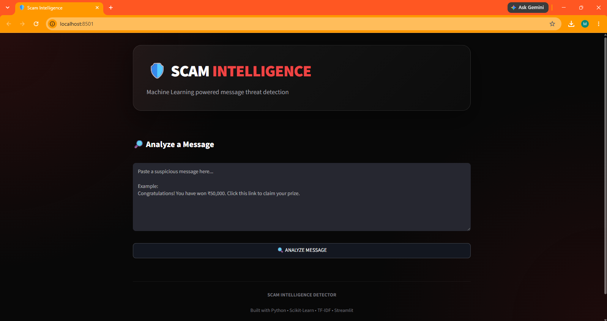

🛡️ Scam Message Detector

Machine Learning powered scam and phishing message detection

Detect whether a message is likely to be SAFE or SCAM using Natural Language Processing and Machine Learning.

Built with Python • Scikit-Learn • TF-IDF • Streamlit

🚀 Overview

Scam Message Detector is an NLP-based Machine Learning classification project that analyzes text messages and predicts whether they contain patterns commonly associated with scams.

The project implements a complete ML pipeline:

Dataset → Text Preprocessing → TF-IDF → Model Training → Evaluation → Prediction → Streamlit Dashboard

✨ Features
📨 Scam/Safe message classification
🧠 TF-IDF text feature extraction
🤖 Multiple ML classification algorithms
📊 Model performance evaluation
🎯 Prediction confidence score
🖥️ Interactive Streamlit dashboard
🚨 Scam warning and safety guidance
💾 Saved trained model and TF-IDF vectorizer
🌙 Dark-themed dashboard UI
🧠 Machine Learning Models

The project evaluates three classification algorithms:

Model	Accuracy
Logistic Regression	100%
Naive Bayes	100%
Random Forest	100%
🏆 Selected Model

Logistic Regression

The Logistic Regression model was selected as the final model used by the application.

Note: The current dataset is synthetic and contains 1,000 records. The 100% test accuracy should therefore not be interpreted as real-world scam-detection performance.

📊 Dataset

The dataset contains 1,000 messages with two columns:

Feature	Description
message	Text message to classify
label	0 = SAFE, 1 = SCAM

Dataset distribution:

500 SAFE messages
500 SCAM messages

The dataset is stored in:

data/messages.csv
🔬 Machine Learning Pipeline
┌──────────────────────┐
│    Message Dataset   │
└──────────┬───────────┘
           │
           ▼
┌──────────────────────┐
│  Text Preprocessing  │
└──────────┬───────────┘
           │
           ▼
┌──────────────────────┐
│    TF-IDF Vectorizer │
└──────────┬───────────┘
           │
           ▼
┌──────────────────────┐
│   Train ML Models    │
├──────────────────────┤
│ Logistic Regression  │
│ Naive Bayes          │
│ Random Forest        │
└──────────┬───────────┘
           │
           ▼
┌──────────────────────┐
│  Model Evaluation    │
└──────────┬───────────┘
           │
           ▼
┌──────────────────────┐
│ Logistic Regression  │
│    Selected Model    │
└──────────┬───────────┘
           │
           ▼
┌──────────────────────┐
│ Streamlit Dashboard  │
└──────────────────────┘
🖥️ Dashboard

The Streamlit application allows users to enter a message and receive:

🚨 Scam/Safe prediction
📈 Prediction confidence
🤖 Model information
⚠️ Security guidance
📊 Analysis summary
Dashboard Screenshot

Add your screenshot here:

screenshots/dashboard.png

Then use:

  

🛠️ Tech Stack
Category	Technologies
Language	Python
Data Processing	Pandas, NumPy
NLP	TF-IDF
Machine Learning	Scikit-Learn
Models	Logistic Regression, Naive Bayes, Random Forest
Model Persistence	Joblib
UI	Streamlit
📁 Project Structure
SCAM-MESSAGE-DETECTOR/
│
├── app/
│   └── app.py
│
├── data/
│   ├── generate_data.py
│   └── messages.csv
│
├── models/
│   ├── scam_message_model.pkl
│   └── tfidf_vectorizer.pkl
│
├── src/
│   ├── predict.py
│   └── train.py
│
├── screenshots/
│   └── dashboard.png
│
├── .gitignore
├── requirements.txt
└── README.md
⚙️ Installation
1. Clone the repository
git clone https://github.com/Afrid-40/Scam-Message-Detector.git
cd Scam-Message-Detector
2. Create a virtual environment
python -m venv venv
3. Activate the environment

Windows:

venv\Scripts\activate

macOS/Linux:

source venv/bin/activate
4. Install dependencies
pip install -r requirements.txt
🧪 Train the Model

To retrain the models:

python src/train.py

The trained model and TF-IDF vectorizer are saved in:

models/
🎯 Command-Line Prediction

Run:

python src/predict.py

Example:

==================================================
       SCAM MESSAGE DETECTOR
==================================================

Enter a message to analyze:
> Congratulations! You have won ₹50,000. Click this link to claim your prize.

==================================================
🚨 SCAM DETECTED
Confidence: 92.79%
==================================================

Safe message example:

> Hey, are we still meeting tomorrow?

==================================================
✅ SAFE MESSAGE
Confidence: 91.72%
==================================================
▶️ Run the Streamlit Dashboard

Start the application:

streamlit run app/app.py

The dashboard will normally be available at:

http://localhost:8501
📈 Evaluation

The models were evaluated using:

Accuracy
Precision
Recall
F1-score

For the current synthetic dataset, all three tested models achieved:

100% test accuracy

The project uses Logistic Regression as the deployed prediction model.

🔮 Future Improvements
🌐 Deploy the dashboard online
📚 Train on larger real-world SMS/phishing datasets
🔗 Detect suspicious URLs
🧠 Add explainable AI
📊 Add prediction history and analytics
🚨 Detect phishing-specific patterns
🌍 Support multiple languages
📱 Improve mobile experience
🔄 Continuously retrain with new scam patterns
⚠️ Disclaimer

This project is intended for educational and demonstration purposes.

The current dataset is synthetic, and the model's predictions should not be treated as definitive proof that a message is safe or malicious.

Always verify suspicious messages through official channels and avoid sharing passwords, OTPs, banking information, or other sensitive information.

👨‍💻 Author

Mohammed Shahed Afrid Khan

Machine Learning • Artificial Intelligence • Python • Data Science

GitHub:
https://github.com/Afrid-40

⭐ Support

If you found this project useful or interesting, consider giving the repository a ⭐.

Built with Python • Scikit-Learn • TF-IDF • Streamlit

